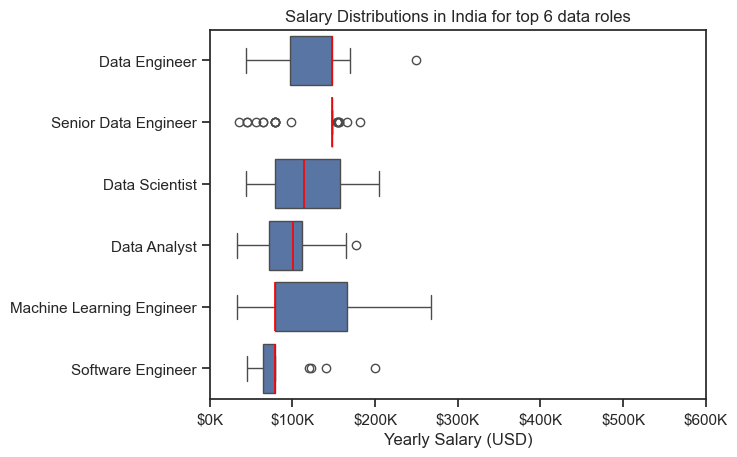
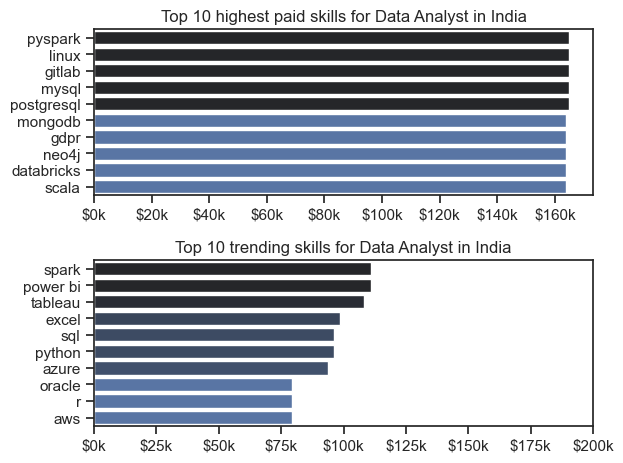
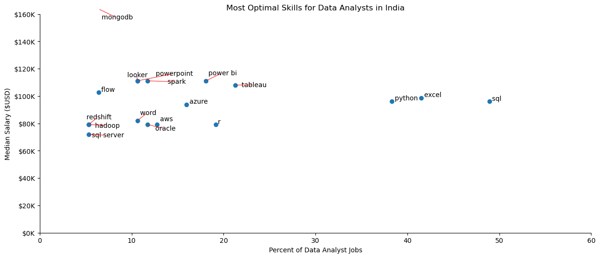
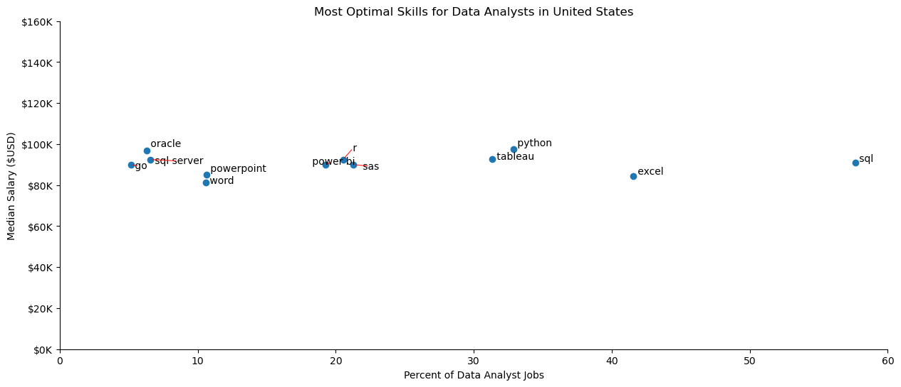

# 🛠️ Technologies Used
- **Python** (`Pandas`, `Matplotlib`, `Seaborn`, `Numpy`, etc.)
- **Jupyter Notebook** / **Google Colab**
- **Excel / CSV** files for data
- **Git & GitHub** for version control
- **HuggingFace Dataset** `https://huggingface.co/datasets/lukebarousse/data_jobs`


# The Analysis
## 1) What are the top demanding skills for the top 3 data roles in India?
This analysis identifies the **most in-demand skills** for the **top 3 data roles in India** using Pandas for data processing. Job positions were filtered based on popularity, and the **top 5 skills** for these roles were extracted.  

The findings are visually represented using **Matplotlib and Seaborn**, showcasing the most common job titles and their key skills. This study provides valuable insights into the **essential skills** required for each role, helping professionals align their expertise with industry demands.


View my notebook for each steps here: [2_skill_demand.ipynb](./2_skill_demand.ipynb)

### Visualize Data:

```python 
job_titles = df_India["job_title"].value_counts().head(3).index.to_list()
job_titles

sns.set_theme(style="ticks")

fig, ax = plt.subplots(len(job_titles), 1)

for i, job_title in enumerate(job_titles):
    df_plot = df_skill_perc[df_skill_perc["job_title_short"] == job_title].head(5)
    # df_plot.plot(kind="barh", x="job_skills", y="percentage", ax=ax[i], title=job_title, legend=False)
    sns.barplot(data=df_plot, x="percentage", y="job_skills", ax=ax[i], hue="skill_count", palette="dark:b_r", legend=False)
    ax[i].set_title(job_title)
    ax[i].set_ylabel("")
    ax[i].set_xlabel("")
    ax[i].set_xlim(0, 80)
    
    for n, v in enumerate(df_plot['percentage']):
        # print(n, v)
        ax[i].text(v + 1, n, f'{v:.0f}%', va='center') # v + 1 for space
        
    if i != len(job_titles) - 1:
        ax[i].set_xticks([])

    
fig.suptitle("Counts of top skills in top 3 data roles in India")
plt.tight_layout()
plt.show()
```

### Results:


### Insights:

- **SQL and Python are the Most In-Demand Skills**  
  SQL is the most required skill for Senior Data Engineers (72%) and Data Engineers (68%).  
  Python is the most essential skill for Data Scientists (70%) and also highly demanded in other roles.  

- **Data Engineers and Senior Data Engineers Require Similar Skills**  
  Both roles require SQL, Python, Spark, AWS, and Azure.  
  The demand for Spark and AWS is higher in Senior Data Engineer roles.  

- **Data Scientists Rely on a Different Skill Set**  
  Python (70%) and SQL (48%) are crucial, but there is also demand for R (33%), AWS (19%), and Tableau (18%).  
  R and Tableau are unique to Data Scientist roles, as they are not listed for Data Engineers.  

- **Cloud and Big Data Technologies are Important for Engineering Roles**  
  AWS, Azure, and Spark are key skills for Data Engineers and Senior Data Engineers.  
  Azure (36-37%) and AWS (37-46%) have notable demand.  

## Conclusions:

- SQL and Python are must-have skills across all top 3 data roles in India.  
- Data Science roles require R and Tableau, while Data Engineering roles focus more on Spark, AWS, and Azure.  
- Cloud platforms (AWS, Azure) and big data tools (Spark) are highly valued, especially for engineering positions.  
- Senior Data Engineers require advanced expertise in Spark, AWS, and SQL to handle larger datasets and infrastructure. 

## 2) How are in-demand skills trending for Machine Learning in India?
This analysis explores the trending skills required for **Machine Learning (ML) jobs in India** throughout the year 2023. By analyzing job posting data, we identify which skills are in high demand and how their popularity fluctuates over time. The study focuses on essential ML skills like **Python, PyTorch, TensorFlow, AWS, and SQL**, providing valuable insights for professionals looking to align their skillset with industry trends.  

Understanding these trends can help job seekers and professionals make **data-driven career decisions**, focusing on the most valuable technologies and frameworks for ML roles in India.  

View my notebook for each steps here: [3_skill_trend.ipynb](./3_skill_trend.ipynb)

### Visualize Data:

```python 

df_plot = df_ml_India_percentage.iloc[:, :5] # only top 5 skills

sns.set_theme(style="ticks")
sns.lineplot(data=df_plot, dashes=False, palette="tab10")
sns.despine()

plt.title("Trending Top Skills for Machine Learning in India")
plt.ylabel("Likelihood of Job Posting")
plt.xlabel("2023")
plt.legend().remove()
plt.tight_layout()

from matplotlib.ticker import PercentFormatter
ax = plt.gca()
ax.yaxis.set_major_formatter(PercentFormatter())
```
### Results:


### Insights:  

- **Python Remains the Most In-Demand Skill**  
  Python dominates job postings, maintaining a **70%+ demand** throughout the year.  
  It peaks around **June** and remains consistently relevant across all months.  

- **PyTorch and TensorFlow Compete for Popularity**  
  Both frameworks show fluctuating demand, but **PyTorch gains momentum towards the end of the year**.  
  TensorFlow remains relevant, but PyTorch’s upward trend suggests a shift in industry preference.  

- **Cloud Skills are Essential for ML Professionals**  
  AWS demand remains steady, indicating the **growing role of cloud computing in ML workflows**.  
  This highlights the importance of **deploying ML models on cloud platforms**.  

- **SQL Shows an Unstable Demand Curve**  
  SQL demand fluctuates, indicating **it is useful but not always a core skill for ML roles**.  
  It may be more relevant for **data-heavy roles** like Data Science and Engineering.  

- **Seasonal Trends Impact Hiring**  
  Skill demand **shifts around mid-year (June) and late-year (October-November)**.  
  Job seekers should **time their applications strategically** to align with industry hiring trends.  

  ## Conclusions:  

- **Python is a Fundamental Skill for ML Jobs in India.**  
  It remains the most in-demand skill, making it essential for ML professionals.  

- **Deep Learning Frameworks are Gaining Popularity.**  
  PyTorch and TensorFlow are crucial, with **PyTorch showing increasing demand** towards the end of the year.  

- **Cloud and Big Data Skills are Valuable.**  
  AWS remains a **key skill for ML engineers**, reinforcing the importance of cloud-based deployments.  

- **SQL is Useful but Not Always Essential.**  
  SQL demand fluctuates, suggesting **its importance in data handling but not always a core ML requirement**.  

- **ML Hiring Trends are Seasonal.**  
  Skill demand spikes in **mid-year (June) and late-year (October-November)**, indicating strategic job application periods. 

## 3) How well do different data roles pay? Top 10 highest-paid skills for Data Analysts & top 10 most in-demand.
This analysis explores salary distributions for the **top 6 data roles in India** and identifies the **highest-paid** and **most in-demand skills** for Data Analysts. By analyzing salary trends, we gain insights into how different roles compare in terms of earnings and which skills contribute to higher pay.  

The salary distribution chart highlights variations across roles, while the skill-based analysis focuses on the **top 10 highest-paying skills** and the **top 10 trending skills** for Data Analysts. These insights can help professionals make **data-driven career decisions** by prioritizing the most valuable and in-demand technologies in the industry.

View my notebook for each steps here: [4_salary_analysis.ipynb](./4_salary_analysis.ipynb)

### Visualize Data

```python
import seaborn as sns
import matplotlib.pyplot as plt

sns.set_theme(style='ticks')
sns.boxplot(data=df_ind_top6, x='salary_year_avg', y='job_title_short', medianprops={"color": "red", "linewidth": 1.2}, order=job_order)

plt.title('Salary Distributions in India for top 6 data roles')
plt.xlabel('Yearly Salary (USD)')
plt.ylabel('')
plt.xlim(0, 600000)

ticks_x = plt.FuncFormatter(lambda y, pos: f'${int(y/1000)}K')
plt.gca().xaxis.set_major_formatter(ticks_x)

plt.show()
```
### Results:




```python
fig, ax = plt.subplots(2,1)
sns.set_theme(style="ticks")


sns.barplot(data=df_DA_India_top_pay, x="median", y=df_DA_India_top_pay.index, ax=ax[0], hue="median", palette="pastel")
# ax[0].invert_yaxis()
ax[0].set_title("Top 10 highest paid skills for Data Analyst in India")
ax[0].set_ylabel("")
ax[0].set_xlabel("")
ax[0].legend().remove()
ax[0].xaxis.set_major_formatter(plt.FuncFormatter(lambda x, pos: f"${int(x/1000)}k"))


sns.barplot(data=df_DA_India_top_trend, x="median", y=df_DA_India_top_trend.index, ax=ax[1], legend=False, hue="median", palette="pastel") # r for reverse coloring
ax[1].invert_yaxis()
ax[1].set_xlim(0, 200000)
ax[1].set_title("Top 10 trending skills for Data Analyst in India")
ax[1].set_ylabel("")
ax[1].set_xlabel("")
# ax[1].legend().remove()
ax[1].xaxis.set_major_formatter(plt.FuncFormatter(lambda x, pos: f"${int(x/1000)}k"))

plt.tight_layout()
```
### Results:



### Insights:  

- **Data Engineers and Senior Data Engineers Earn Higher Salaries**  
  These roles have a **higher median salary range**, reflecting the growing demand for data infrastructure expertise.  

- **Machine Learning Engineers Have a Broad Salary Range**  
  The salaries for Machine Learning Engineers **vary significantly**, suggesting different experience levels and specialization impacts.  

- **Data Analysts and Software Engineers Earn Comparatively Lower Salaries**  
  The median salaries for these roles are **lower than Data Engineers and Machine Learning Engineers**, indicating market positioning and demand differences.  

- **Top-Paid Skills for Data Analysts Focus on Big Data and Cloud Technologies**  
  **PySpark, Linux, PostgreSQL, MongoDB, and Databricks** are among the highest-paying skills, highlighting the importance of **data processing and cloud solutions**.  

- **Trending Skills for Data Analysts Reflect Industry Demand for BI and Cloud Platforms**  
  **Power BI, Tableau, SQL, and Azure** are among the most sought-after skills, showcasing the need for **data visualization, analysis, and cloud proficiency**.  

## Conclusions:  

- **Data Engineering and ML Engineering are High-Paying Career Paths.**  
  Professionals aiming for **higher salaries** should consider upskilling in **data infrastructure and ML technologies**.  

- **Big Data and Cloud Computing Skills Drive Higher Salaries.**  
  Technologies like **PySpark, Databricks, PostgreSQL, and AWS** are crucial for securing **top-paying Data Analyst roles**.  

- **Data Visualization and Business Intelligence Tools Are Essential.**  
  Skills like **Power BI, Tableau, and SQL** are key for Data Analysts looking to improve their marketability.  

- **Salary Potential Varies Widely by Experience and Skillset.**  
  Professionals should **align their learning path with high-paying and high-demand skills** for maximum career growth.  

- **Strategic Skill Development Can Boost Career Prospects.**  
  Focusing on **both in-demand and high-paying skills** ensures job security and better salary negotiations.  


## 4) What are the optimal skills for Data Analyst job role in India and its comparison against USA? Combining trend and salary using a scatter plot.
This scatter plot analysis combines **salary data** with **skill demand trends** for Data Analyst roles in both **India and the US**. It highlights which skills are most valuable, not just in terms of demand but also compensation—helping aspiring analysts prioritize what to learn.

View my notebook for each steps here: [5_optimum_skills.ipynb](./5_optimal_skills.ipynb)

```python
from adjustText import adjust_text

plt.figure(figsize=(12, 6))

plt.scatter(df_DA_skills_high_demand['skill_percent'], df_DA_skills_high_demand['median_salary'])
plt.xlabel('Percent of Data Analyst Jobs')
plt.ylabel('Median Salary ($USD)')  
plt.title(f'Most Optimal Skills for Data Analysts in {country_name}')


ax = plt.gca()
ax.yaxis.set_major_formatter(plt.FuncFormatter(lambda y, pos: f'${int(y/1000)}K')) 

texts = []
for i, txt in enumerate(df_DA_skills_high_demand.index):
    texts.append(plt.text(df_DA_skills_high_demand['skill_percent'].iloc[i], df_DA_skills_high_demand['median_salary'].iloc[i], " " + txt))

adjust_text(
    texts,
    arrowprops=dict(arrowstyle='-', color='red', lw=0.7, shrinkA=2, shrinkB=2),
    force_text=0.5,     
    force_points=0.1,   
    expand_points=(1.2, 1.4),
    expand_text=(1.2, 1.4),
    only_move={'points':'y', 'text':'xy'}  
)

plt.show()
```
### Results:
### Comparison of India and US Data Analyst Jobs:




### Insights:  
- **Python is the most in-demand skill in India**  
  Python appears in **~39% of data analyst job listings**, showing it's the **top expected skill** in India.

- **In the US, Python is the highest-paying skill**  
  Even with lower demand than SQL, Python commands a **median salary of ~$98K**, proving its **technical value**.

- **MongoDB pays the highest in India**  
  MongoDB has a **median salary over $160K**, suggesting it's a **high-value niche skill** despite lower demand.

- **SQL dominates US demand**  
  Found in **~58% of US jobs**, SQL remains the **foundation skill** for analysts in the US.

- **Power BI and Tableau are hot in both countries**  
  These BI tools are **consistently in demand**, making them **must-learn skills** for visualization.

- **Excel remains strong in both markets**  
  Excel is still listed frequently, showing it's a **core operational tool** even for modern analysts.

- **Legacy tools like Oracle and SAS pay well in the US**  
  Though less common, these skills yield **high median salaries**, likely due to **niche enterprise usage**.

- **India shows broader tool diversity; US is more focused**  
  India's market spans skills like **Spark, Hadoop, MongoDB**, while the US stays centered around **Python, SQL, Tableau**.

## Comparison & Conclusion:
- **India values versatility, the US favors specialization**
Indian roles often demand a wider variety of tools **(like MongoDB, Spark, Hadoop)**, while US roles lean towards depth in core skills like **Python** and **SQL**.

- **Python: In-demand in India, high-paying in the US**
In **India**, **Python is the most required skill** **(~39%)**, whereas in the **US**, it fetches top salaries **(~$98K median)**, likely due to advanced applications.

- **MongoDB pays more in India despite lower demand**
**MongoDB** offers high salary potential in India (~$160K median), suggesting a niche skill gap where **supply is limited**.

- **SQL is foundational in the US**
With presence in ~58% of job postings, **SQL** is a **non-negotiable** skill for analysts in the **US** job market.

- **BI tools are must-haves globally**
Power BI and Tableau remain **in-demand** in **both regions**, making them critical for data storytelling and dashboarding.

- **Excel still matters**
Despite the rise of modern tools, **Excel is still listed frequently**, proving its importance in everyday data operations.


# Thank You!!
Thank you for checking out this project!  
If you found it helpful or interesting, feel free to give it a ⭐ on GitHub and share your thoughts or suggestions.

# Contact
- **Author:** Sujal Karmakar  
- **Email:** sujalkarmakar6363@gmail.com 
- **GitHub:** [@Sujalk63](https://github.com/Sujalk63)


