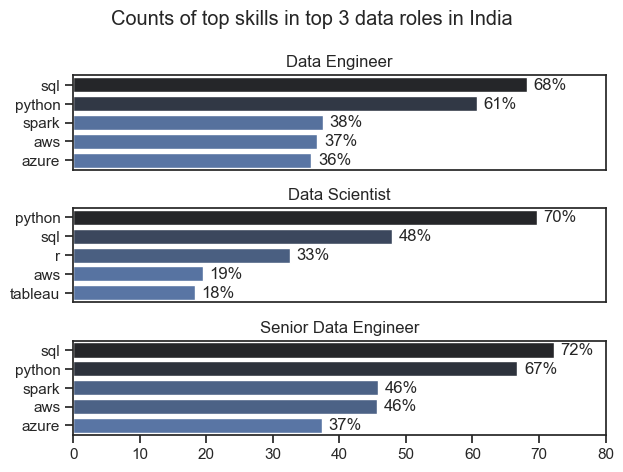
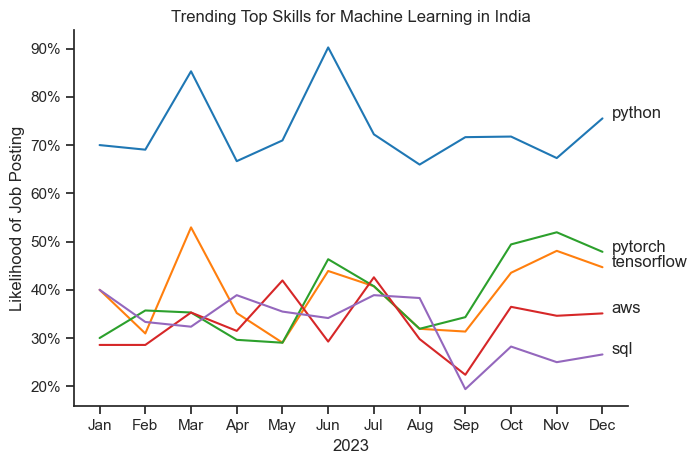

# The Analysis
## 1) What are the top demanding skills for the top 3 data roles in India?
This analysis identifies the most in-demand skills for the top 3 data roles in India using Pandas for data processing. Job positions were filtered based on popularity, and the top 5 skills for these roles were extracted. The findings are visually demonstrated using Matplotlib and Seaborn, highlighting the most common job titles and their key skills, providing insights into the essential skills for each role.

View my notebook for each steps here: [2_skill_demand.ipynb](./2_skill_demand.ipynb)

### Visualize Data

```python 
job_titles = df_India["job_title"].value_counts().head(3).index.to_list()
job_titles

sns.set_theme(style="ticks")

fig, ax = plt.subplots(len(job_titles), 1)

for i, job_title in enumerate(job_titles):
    df_plot = df_skill_perc[df_skill_perc["job_title_short"] == job_title].head(5)
    # df_plot.plot(kind="barh", x="job_skills", y="percentage", ax=ax[i], title=job_title, legend=False)
    sns.barplot(data=df_plot, x="percentage", y="job_skills", ax=ax[i], hue="skill_count", palette="dark:b_r", legend=False)
    ax[i].set_title(job_title)
    ax[i].set_ylabel("")
    ax[i].set_xlabel("")
    ax[i].set_xlim(0, 80)
    
    for n, v in enumerate(df_plot['percentage']):
        # print(n, v)
        ax[i].text(v + 1, n, f'{v:.0f}%', va='center') # v + 1 for space
        
    if i != len(job_titles) - 1:
        ax[i].set_xticks([])

    
fig.suptitle("Counts of top skills in top 3 data roles in India")
plt.tight_layout()
plt.show()
```

### Results:



### Insights

- **SQL and Python are the Most In-Demand Skills**  
  SQL is the most required skill for Senior Data Engineers (72%) and Data Engineers (68%).  
  Python is the most essential skill for Data Scientists (70%) and also highly demanded in other roles.  

- **Data Engineers and Senior Data Engineers Require Similar Skills**  
  Both roles require SQL, Python, Spark, AWS, and Azure.  
  The demand for Spark and AWS is higher in Senior Data Engineer roles.  

- **Data Scientists Rely on a Different Skill Set**  
  Python (70%) and SQL (48%) are crucial, but there is also demand for R (33%), AWS (19%), and Tableau (18%).  
  R and Tableau are unique to Data Scientist roles, as they are not listed for Data Engineers.  

- **Cloud and Big Data Technologies are Important for Engineering Roles**  
  AWS, Azure, and Spark are key skills for Data Engineers and Senior Data Engineers.  
  Azure (36-37%) and AWS (37-46%) have notable demand.  

## Conclusions

- SQL and Python are must-have skills across all top 3 data roles in India.  
- Data Science roles require R and Tableau, while Data Engineering roles focus more on Spark, AWS, and Azure.  
- Cloud platforms (AWS, Azure) and big data tools (Spark) are highly valued, especially for engineering positions.  
- Senior Data Engineers require advanced expertise in Spark, AWS, and SQL to handle larger datasets and infrastructure. 

## 2) How are in-demand skills trending for Machine Learning in India?
This analysis explores the trending skills required for **Machine Learning (ML) jobs in India** throughout the year 2023. By analyzing job posting data, we identify which skills are in high demand and how their popularity fluctuates over time. The study focuses on essential ML skills like **Python, PyTorch, TensorFlow, AWS, and SQL**, providing valuable insights for professionals looking to align their skillset with industry trends.  

Understanding these trends can help job seekers and professionals make **data-driven career decisions**, focusing on the most valuable technologies and frameworks for ML roles in India.  

View my notebook for each steps here: [2_skill_demand.ipynb](./3_skill_trend.ipynb)

### Visualize Data

```python 

df_plot = df_ml_India_percentage.iloc[:, :5] # only top 5 skills

sns.set_theme(style="ticks")
sns.lineplot(data=df_plot, dashes=False, palette="tab10")
sns.despine()

plt.title("Trending Top Skills for Machine Learning in India")
plt.ylabel("Likelihood of Job Posting")
plt.xlabel("2023")
plt.legend().remove()
plt.tight_layout()

from matplotlib.ticker import PercentFormatter
ax = plt.gca()
ax.yaxis.set_major_formatter(PercentFormatter())
```
### Results:



### Insights  

- **Python Remains the Most In-Demand Skill**  
  Python dominates job postings, maintaining a **70%+ demand** throughout the year.  
  It peaks around **June** and remains consistently relevant across all months.  

- **PyTorch and TensorFlow Compete for Popularity**  
  Both frameworks show fluctuating demand, but **PyTorch gains momentum towards the end of the year**.  
  TensorFlow remains relevant, but PyTorch’s upward trend suggests a shift in industry preference.  

- **Cloud Skills are Essential for ML Professionals**  
  AWS demand remains steady, indicating the **growing role of cloud computing in ML workflows**.  
  This highlights the importance of **deploying ML models on cloud platforms**.  

- **SQL Shows an Unstable Demand Curve**  
  SQL demand fluctuates, indicating **it is useful but not always a core skill for ML roles**.  
  It may be more relevant for **data-heavy roles** like Data Science and Engineering.  

- **Seasonal Trends Impact Hiring**  
  Skill demand **shifts around mid-year (June) and late-year (October-November)**.  
  Job seekers should **time their applications strategically** to align with industry hiring trends.  

  ## Conclusions  

- **Python is a Fundamental Skill for ML Jobs in India.**  
  It remains the most in-demand skill, making it essential for ML professionals.  

- **Deep Learning Frameworks are Gaining Popularity.**  
  PyTorch and TensorFlow are crucial, with **PyTorch showing increasing demand** towards the end of the year.  

- **Cloud and Big Data Skills are Valuable.**  
  AWS remains a **key skill for ML engineers**, reinforcing the importance of cloud-based deployments.  

- **SQL is Useful but Not Always Essential.**  
  SQL demand fluctuates, suggesting **its importance in data handling but not always a core ML requirement**.  

- **ML Hiring Trends are Seasonal.**  
  Skill demand spikes in **mid-year (June) and late-year (October-November)**, indicating strategic job application periods.  


